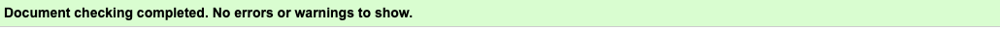
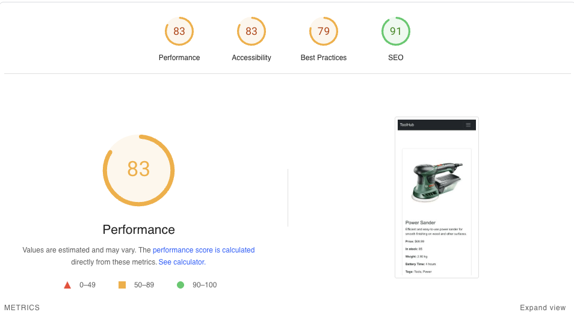

# Testing Documentation for ToolHub Web Application

  

# Contents

* [Validation](#validation)
    * [HTML Validation](#html-validation)
    * [CI Python Linter](#ci-python-linter)
    * [Lighthouse](#lighthouse)
* [User Story Testing](#user-story-testing)
    * [General](#general)
    * [Logged Out](#logged-out)
    * [Logged In User](#logged-in-user)
    * [Admin](#admin)
* [Manual Testing](#manual-testing)

  
# Validation

## HTML Validation

All pages pass HTML Validation at [W3C markup validation service](https://validator.w3.org/)

Home page

 

Store

 

Product detail page

 

Cart page

 

Dashboard page

 

Checkout page

 

Login page

 

Signup page

 

Logout page

 

  

## CI Python Linter

All Python files are run through the CI PEP8 Linter.

### Cart app

models.py

 

views.py

 

### Core app

views.py

 

### Orders app

models.py

 

views.py

 

### Payments app

models.py

 

views.py

 

### Product Wishlist app

models.py

 

views.py

 

context_processors.py

 

### Products app

models.py

 

views.py

 

filters.py

 

### Reviews app

models.py

 

views.py

 

forms.py

 

### User Profile app

views.py

 

## Lighthouse

### Desktop

Home page

 

Shop page

 

Product detail page

 

Dashboard page

 

Cart page

 

Checkout page

 

Login page

 

Signup page

 

Logout page

 

  

### Mobile

Home page

 

Shop page

 

Product detail page

 

Dashboard page

 

Cart page

 

Checkout page

 

Login page

 

Signup page

 

Logout page

 

  

# User Story Testing

## General

| User Story                                                                                        | Feature                                                                                     |
| ------------------------------------------------------------------------------------------------ | ------------------------------------------------------------------------------------------- |
| I want to immediately identify the purpose of the site.                                           | Logo in header displaying app name, and the homepage featuring a welcome message and CTA.  |
| I want navigation to be simple and intuitive.                                                     | Navigation links are placed logically with a responsive navbar (Hamburger menu for mobile). |
| I want to be able to view the site on any device.                                                 | The site is fully responsive and mobile-friendly, designed using the Bootstrap framework.   |

  

## Logged Out

| User Story                                         | Feature                                                            |
| -------------------------------------------------- | ------------------------------------------------------------------ |
| I want to be able to log in/signup to the service.  | Both login and register features available on the homepage.       |

  

## Logged In User

| User Story                                                                 | Feature                                                              |
| -------------------------------------------------------------------------- | -------------------------------------------------------------------- |
| I want to be able to manage my cart and checkout process.                  | Cart page allows viewing, updating, and removing items. Checkout page for entering shipping information. |
| I want to be able to manage my orders and track them.                       | Order history and order tracking available on the account page.     |
| I want to be able to leave reviews for products.                            | Product pages allow users to leave reviews and ratings.             |

  

## Admin

| User Story                                                                  | Feature                                                              |
| --------------------------------------------------------------------------- | -------------------------------------------------------------------- |
| I want to be able to manage all user accounts.                              | Admin can view, edit, and delete users from the admin panel.         |
| I want to be able to manage all products listed in the shop.                | Admin can add, edit, and delete products from the admin panel.       |
| I want to be able to see and manage orders placed by users.                 | Admin can view, update, and delete orders from the admin panel.      |
| I want to be able to remove any inappropriate reviews left by users.        | Admin can remove reviews via the admin panel.                        |

  

# Manual Testing

| Feature/Test                                         | Expected Outcome                                                        | Result |
| ---------------------------------------------------- | ----------------------------------------------------------------------- | ------ |
| Logo in Navbar.                                       | Redirects to Homepage.                                                  | Pass   |
| Nav Links.                                           | Redirect to relevant pages.                                              | Pass   |
| Cart Update Button.                                  | Allows updating the number of items in the cart.                        | Pass   |
| Footer Links                                         | Opens relevant external sites in new tabs.                              | Pass   |
| Login Form - Empty                                   | Form will not submit if fields are empty.                               | Pass   |
| Login Form - Incorrect Username                      | Form submits, but does not log in, displays an error message.           | Pass   |
| Login Form - Correct Username and Password           | Form submits and redirects to the dashboard.                            | Pass   |
| Logout Button                                        | Logs user out and redirects to Homepage.                                | Pass   |
| Product Page - Add to Cart                           | Product is added to cart successfully.                                  | Pass   |
| Product Page - Add Review                           | Review is added and visible under the product detail page.              | Pass   |
| Cart - Update Quantity                              | Quantity of items in cart can be updated.                              | Pass   |
| Checkout Form - Missing Information                  | Displays error messages for missing required fields.                   | Pass   |
| Checkout Form - Correct Information                  | Successfully processes order and displays confirmation.                | Pass   |
| Admin Panel - Manage Products                        | Admin can add, edit, and delete products.                               | Pass   |
| Admin Panel - Manage Orders                         | Admin can view and manage orders.                                       | Pass   |
| Admin Panel - Manage Users                          | Admin can view, edit, and delete users.                                 | Pass   |